# Архитектура Book Analyzer — актуальная (сессия 013)

_Полная архитектура системы парсинга книг по состоянию на **сессию 013 (2026-06-28)**._

_В отличие от более раннего снимка, здесь отражены последние механизмы кода: **сравнение источников тела книги `_pick_body_source` (s012)**, **удаление постраничных водяных знаков (s013)**, 9-стадийный маппинг, list-context preference, Class-2 Fix A/B, smart ToC fallback с валидацией и embedding-модель `text-embedding-qwen3-0.6b`._

_Хронология «какая фича в какой сессии» — в **разделе 12** в конце документа._

_Все диаграммы — Mermaid. Рендерятся в GitHub, VSCode (Mermaid Preview), на [mermaid.live](https://mermaid.live) и в этом HTML-файле._

---

## 1. Карта модулей и их зависимостей

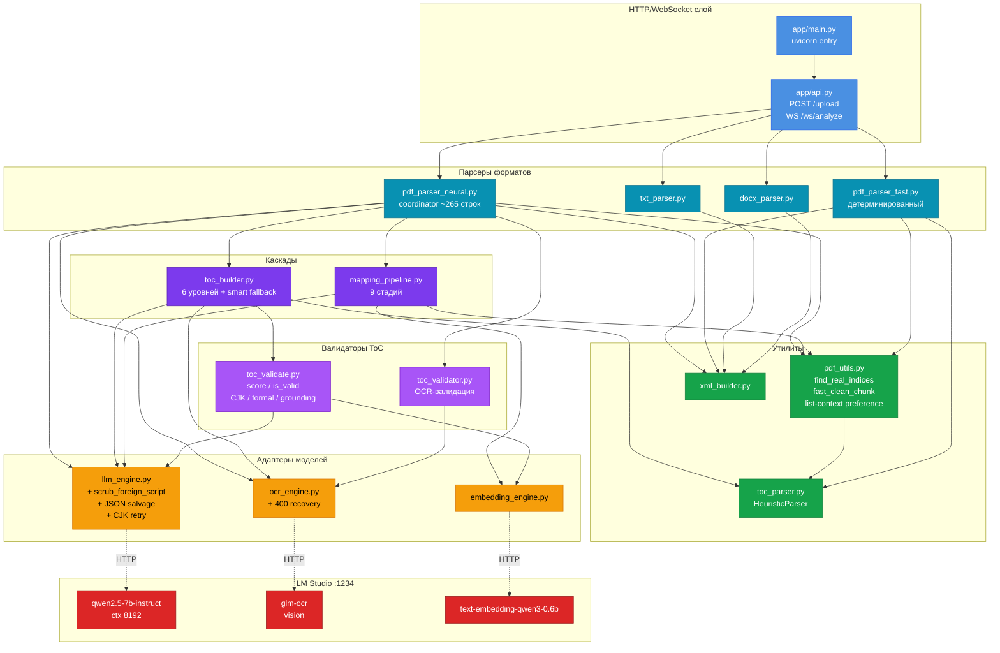

**Логическое разделение по слоям**:

| Слой | Модули | Ответственность |
|---|---|---|
| **HTTP** | `api.py`, `main.py` | Приём файлов, WebSocket-прогресс, отдача XML |
| **Парсеры форматов** | `pdf_parser_*`, `docx_parser`, `txt_parser` | Entry-point для каждого формата |
| **Каскады** | `toc_builder`, `mapping_pipeline` | Отказоустойчивая многоуровневая логика |
| **Валидаторы** | `toc_validate`, `toc_validator` | Качественные гейты для LLM-источников |
| **Адаптеры** | `llm_engine`, `embedding_engine`, `ocr_engine` | Изоляция от деталей LM Studio API |
| **Утилиты** | `pdf_utils`, `toc_parser`, `xml_builder` | Переиспользуемые блоки |

---

## 2. Высокоуровневый flow — от загрузки до XML

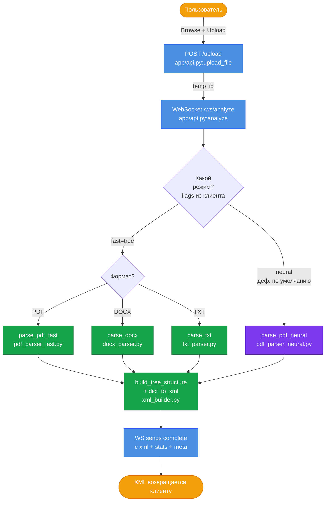

**Точки выбора**:
- **Fast-режим** — детерминированный, без LLM/OCR/embed. Секунды на любую книгу. Используется как baseline.
- **Neural-режим** — каскад с возможным OCR и LLM. Минуты на сложные книги.

Клиент видит прогресс через WebSocket: pipeline шлёт `{type: "progress", pct, message}` на каждой стадии, и `{type: "complete", xml, stats}` в конце.

---

## 3. Neural pipeline целиком

```mermaid
flowchart TD
    NIN([parse_pdf_neural<br/>file_path, flags]) --> READ["check_document_readability<br/>pdf_utils.py"]

    READ -->|is_readable=True| TOC_STAGE
    READ -->|is_readable=False| OCR_CHECK{use_ocr=True<br/>+ OCR доступен?}

    OCR_CHECK -->|Да| OCR_DOC["ocr_client.ocr_document<br/>glm-ocr через LM Studio<br/>ocr_engine.py"]
    OCR_CHECK -->|Нет| ERR_NODE[Возврат узла<br/>«Документ нечитаем»]

    OCR_DOC -->|ocr_text есть| TOC_STAGE[/"build_toc<br/>см. диаграмму ToC Builder ниже"/]
    OCR_DOC -->|пусто| ERR_NODE

    TOC_STAGE -->|sequence, toc_source, ocr_text| VALID_TOC{validate_toc_ocr=True<br/>+ source!=ocr_*?}

    VALID_TOC -->|Да| VALIDATE_OCR["validate_toc_via_ocr<br/>toc_validator.py"]
    VALID_TOC -->|Нет| PICK_BODY
    VALIDATE_OCR --> PICK_BODY["_pick_body_source s12<br/>сравнить text-layer и ocr_text<br/>выбрать тело по качеству+охвату"]
    PICK_BODY --> FULL_TEXT["clean_footer_header<br/>длинные колонтитулы<br/>pdf_utils.py"]
    FULL_TEXT --> FOOTER_JUNK["footer_junk_lines s13<br/>собрать постраничные<br/>водяные знаки"]
    FOOTER_JUNK --> MAP_STAGE[/"map_sequence<br/>см. диаграмму Mapping ниже"/]

    MAP_STAGE -->|mapped| SLICE_LOOP{Для каждой<br/>секции:<br/>нарезка контента}

    SLICE_LOOP --> SLICE[content = full_text<br/>от end_idx до<br/>min start_idx следующих]
    SLICE --> STRIP["strip_junk_lines s13<br/>вырезать водяные знаки<br/>из контента секции"]
    STRIP --> CONF_CHECK{confidence<br/>≥ 0.85?}

    CONF_CHECK -->|Да| FAST_CLEAN["fast_clean_chunk<br/>алгоритм<br/>pdf_utils.py"]
    CONF_CHECK -->|Нет| LLM_BOUNDARY["fix_chapter_boundary<br/>llm_engine.py"]

    LLM_BOUNDARY --> LLM_CLEAN["process_large_text<br/>asyncio.gather параллельно<br/>llm_engine.py"]

    FAST_CLEAN --> SCRUB
    LLM_CLEAN --> SCRUB[scrub_foreign_script<br/>title + content<br/>на ВСЕХ путях]

    SCRUB --> NEXT_SEC{Ещё секции?}
    NEXT_SEC -->|Да| SLICE_LOOP
    NEXT_SEC -->|Нет| XML_BUILD["build_tree_structure<br/>dict_to_xml<br/>xml_builder.py"]

    ERR_NODE --> XML_BUILD
    XML_BUILD --> RETURN([flat_nodes, sequence, meta])

    classDef stage fill:#4a90e2,stroke:#2563eb,color:#fff
    classDef llm fill:#7c3aed,stroke:#5b21b6,color:#fff
    classDef ocr fill:#dc2626,stroke:#991b1b,color:#fff
    classDef algo fill:#16a34a,stroke:#15803d,color:#fff
    classDef guard fill:#a855f7,stroke:#7e22ce,color:#fff
    classDef err fill:#f59e0b,stroke:#d97706,color:#fff

    class READ,FULL_TEXT,SLICE,FAST_CLEAN algo
    class OCR_DOC,VALIDATE_OCR ocr
    class LLM_BOUNDARY,LLM_CLEAN llm
    class TOC_STAGE,MAP_STAGE stage
    class SCRUB,PICK_BODY,FOOTER_JUNK,STRIP guard
    class ERR_NODE err
```

**Ключевые архитектурные правила**:

- `scrub_foreign_script` **всегда последняя** — применяется к title+content каждого узла независимо от пути. **Никогда** не переносить внутрь `fast_clean_chunk` — там она не сработает для fast-path.
- `CONFIDENCE_THRESHOLD=0.85` — фиксированная граница между algo и LLM clean (ADR 001).
- LLM clean — **параллельный** через `asyncio.gather`. Не утверждать sequential.
- **Источник тела (`_pick_body_source`, s12)** выбирается СРАВНЕНИЕМ кандидатов text-layer ↔ OCR, а не флагом читаемости (см. раздел 3.1). До s12 короткий ToC-OCR перекрывал полное читаемое тело — системный баг.
- **Водяные знаки (s13)** вырезаются из КОНТЕНТА уже нарезанной секции (`strip_junk_lines`), а НЕ из `full_text` до маппинга — иначе сдвинулись бы page_cut-позиции (см. раздел 8.1).

---

## 3.1. Выбор источника тела книги — `_pick_body_source` (s012)

`pdf_parser_neural._pick_body_source(text_layer, ocr_text)` — решает, по какому тексту
маппить секции: по текстовому слою PyMuPDF или по OCR-выводу. Это **системный фикс сессии 012**.

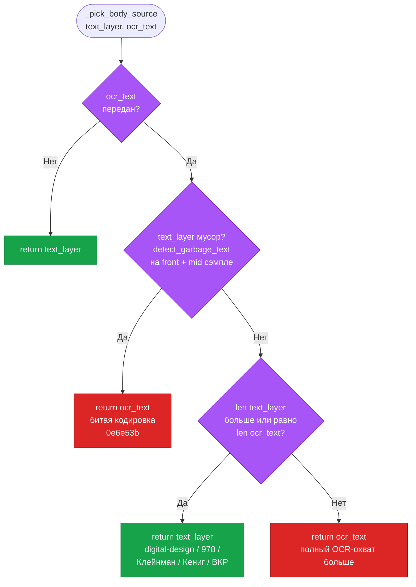

**Какой баг чинит**: раньше было `full_text = ocr_text if ocr_text else get_all_text(doc)`.
Когда документ ЧИТАЕМ, но его ToC потребовал OCR-эскалации, `build_toc` возвращал короткий
`ocr_text` (~25k символов — только зона ToC с leader-dots), и он ПЕРЕКРЫВАЛ полное читаемое
тело (digital-design: 1.586M символов). Маппинг искал секции в 25k ToC → 94 секции уходили
в page_cut во front-matter.

**Почему сравнение, а не флаг**: `check_document_readability` сэмплирует ≤10 страниц и может
ошибиться на книге с разреженным телом. `_pick_body_source` сравнивает САМИ тексты
(garbage-quality + длина/охват), а не доверяет заранее снятому флагу.

**Эффект (системный, не одна книга)**: digital-design 24→97 real; корпус +78 real / +79 eff;
Клейнман 4→40 exact-матчей; Кениг 6→19; ВКР 2→14. Две прежние диагнозы
(«Клейнман: нелинейная пагинация» и «Кениг: subsection-into-toc») оказались ЭТИМ же багом.

> Это второй «механизм сравнения» в системе. Первый — `_select_best` (s004), который
> сравнивает КАНДИДАТОВ ОГЛАВЛЕНИЯ из разных источников по grounding (см. раздел 4.1).

---

## 4. ToC Builder — каскад из 6 уровней + smart fallback с валидацией

`toc_builder.build_toc()` — главная функция извлечения оглавления.

```mermaid
flowchart TD
    BTI([build_toc<br/>doc, full_text_extractor,<br/>ocr_text, flags]) --> OCR_PROVIDED{ocr_text<br/>уже передан<br/>извне?}

    OCR_PROVIDED -->|Да<br/>readability=False| OCR_HEUR["Уровень 3 ускоренно:<br/>HeuristicParser<br/>по split_sticky OCR-тексту"]
    OCR_HEUR --> OCR_LEN{len ≥ TOC_MIN_USEFUL=5?}
    OCR_LEN -->|Да| OUT_OCRH["return seq,<br/>'ocr_heuristic'"]
    OCR_LEN -->|Нет| OCR_LLM["Уровень 4:<br/>llm.extract_toc_json<br/>по OCR-тексту"]
    OCR_LLM --> OUT_OCRL["return seq,<br/>'ocr_llm'"]

    OCR_PROVIDED -->|Нет| RAW_TEXT["Извлечь raw_text<br/>doc первых 20 страниц"]
    RAW_TEXT --> SPLIT["_split_sticky_toc_lines<br/>разбить склейки"]
    SPLIT --> LVL1["Уровень 1:<br/>HeuristicParser.parse_toc"]
    LVL1 --> EARLY_GATE{len ≥ 12<br/>и не high-level-only<br/>и не _looks_incomplete?}

    EARLY_GATE -->|Да| DEDUP_FAST[_dedup_and_order]
    DEDUP_FAST --> OUT_HEUR["return seq,<br/>'heuristic'"]

    EARLY_GATE -->|Нет<br/>SMART FALLBACK| COLLECT[Кандидаты:<br/>heuristic как baseline]

    COLLECT --> LVL2["Уровень 2:<br/>_llm_from_text_retry<br/>с retry на CJK / формальные<br/>ошибки / too-few-items"]
    LVL2 --> ADD2[candidates += llm]

    ADD2 --> SELECT1["_select_best<br/>среди heuristic + llm"]
    SELECT1 --> NEED_ESC{Лучший<br/>не валиден ИЛИ<br/>_looks_incomplete?}

    NEED_ESC -->|Да + use_ocr| LVL3["Уровень 3:<br/>OCR первых 30 страниц<br/>+ HeuristicParser"]
    LVL3 --> ADD3[candidates += ocr_heuristic]
    ADD3 --> LVL4["Уровень 4:<br/>OCR-text + LLM extract"]
    LVL4 --> ADD4[candidates += ocr_llm]
    ADD4 --> SELECT2[_select_best]

    NEED_ESC -->|Нет| SELECT2
    SELECT2 --> DEEP_CHECK{enable_deep_scan<br/>+ len ≤ 5?}

    DEEP_CHECK -->|Да| LVL5["Уровень 5:<br/>propose_structure_from_text<br/>LLM по chunks полного текста<br/>МЕДЛЕННО"]
    LVL5 --> ADD5[candidates += deep_scan]
    ADD5 --> SELECT3[_select_best]
    DEEP_CHECK -->|Нет| SELECT3

    SELECT3 --> EXP_CHECK{enable_llm_expand<br/>+ high-level-only?}
    EXP_CHECK -->|Да| LVL6["Уровень 6:<br/>_llm_expand_parts<br/>LLM ищет главы<br/>внутри ЧАСТЕЙ"]
    LVL6 --> RET([return sequence, source, ocr_text])
    EXP_CHECK -->|Нет| RET

    OUT_OCRH --> RET
    OUT_OCRL --> RET
    OUT_HEUR --> RET

    classDef algo fill:#16a34a,stroke:#15803d,color:#fff
    classDef llm fill:#7c3aed,stroke:#5b21b6,color:#fff
    classDef ocr fill:#dc2626,stroke:#991b1b,color:#fff
    classDef select fill:#a855f7,stroke:#7e22ce,color:#fff

    class LVL1,LVL3,SPLIT,DEDUP_FAST,RAW_TEXT,OCR_HEUR algo
    class LVL2,LVL4,LVL5,LVL6,OCR_LLM llm
    class SELECT1,SELECT2,SELECT3 select
```

**Уровни каскада**:

| Уровень | Метод | Стоимость | Когда срабатывает |
|---|---|---|---|
| **1** | HeuristicParser по PyMuPDF first 20 pages | Мгновенно | Всегда первый шаг |
| **Early exit** | `_dedup_and_order` и возврат | Мгновенно | Heuristic ≥ 12 + не high-level + не `_looks_incomplete` |
| **2** | LLM `extract_toc_json` с retry | Секунды | Если early gate не сработал |
| **3** | OCR первых 30 стр + HeuristicParser | 1–3 мин | Если best ещё не валиден или неполный |
| **4** | OCR-text + LLM `extract_toc_json` | Минуты | Если OCR-heuristic не помог |
| **5** | Deep-scan по chunks полного текста | 10+ мин | Только при `enable_deep_scan=True` И всё ещё ≤ 5 пунктов |
| **6** | LLM-expand: главы внутри ЧАСТЕЙ | Секунды–минуты | Если ToC верхнеуровневый |

**Триггер `_looks_incomplete`** — алгоритмический, без моделей:

```
raw_entries = _count_toc_entry_lines(raw_text)
if raw_entries > len(seq) * 1.5:
    return True  # heuristic неполна → fallback
```

Розенсон: 4.14 → fallback. Клейнман: 1.76 → fallback. Виды UI: 1.0 → не трогаем.
**Caveat**: на ВКР raw_entries=33, heuristic корректно=14, ratio 2.36 → over-trigger; ~170 сек тратятся впустую.

### 4.1. Селекция `_select_best`

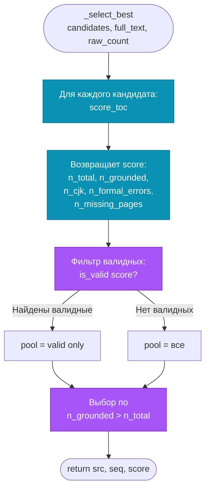

**`is_valid` = formal_ok AND no_CJK AND grounding ≥ 0.8** (`GROUNDING_MIN`).

- **formal_ok**: нет дублей, нет overlong title, монотонные страницы (allow one «reset» — для дв.оглавления).
- **no_CJK**: ни один title не содержит CJK / арабских / корейских символов.
- **grounding**: доля title-ов, реально встречающихся в тексте книги. Lexical-first (значимые токены в тексте), embedder только для не-lexical, cap = 20 (GPU cost).

**Никогда не отдаём невалидированный LLM-вывод** — это политика, ADR 003.

### 4.2. Финальный `_dedup_and_order` с fuzzy-pageless защитой

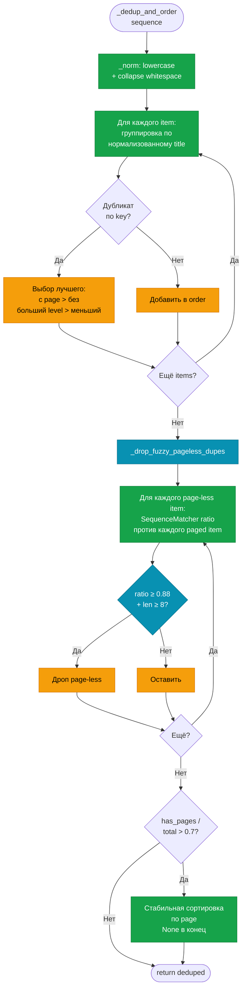

**Fuzzy-pageless** — отдельный второй проход. Цель: ловить OCR-drift варианты того же заголовка («ИЗУЧЕНЯЯ» в одном OCR-проходе vs «ИЗУЧЕНЯЮ» в другом — defeated exact-norm dedup). Threshold 0.88 калиброван: реальные 80+ символьные заголовки разных глав не достигают этого sim. Гард `len < 8` защищает от ложных срабатываний на коротких title.

---

## 5. Mapping Pipeline — 9 стадий

`mapping_pipeline.map_sequence()` — главная функция мапинга секций в текст.

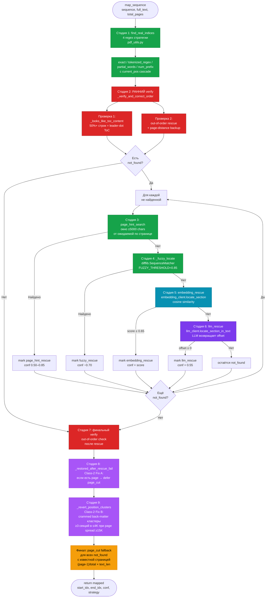

**Особенности**:

- **Раннее verify (стадия 2)** — критично. Без него секции, «найденные» ВНУТРИ ToC-страниц (Release It! 21/36), остаются с conf=1.0 и не доходят до rescue.
- **Embeddings ставятся ДО LLM** — они быстрее и бесплатнее.
- **page_cut — последний шаг**. Применяется только к not_found с известной страницей. Подставляет approximate position по линейной пагинации. Confidence=0.30.

### 5.1. Verification — что именно проверяется

`mapping_pipeline._verify_and_correct_order()`:

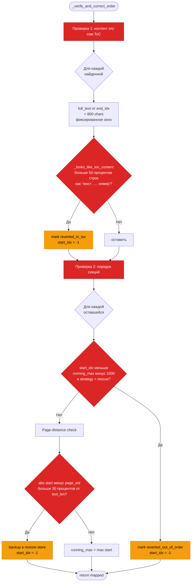

Run TWICE: до и после rescue. Раннее ловит in-ToC и far page-distance матчи. Финальное — out-of-order среди rescue-результатов.

### 5.2. Class-2 Fix A: `_restored_after_rescue_fail`

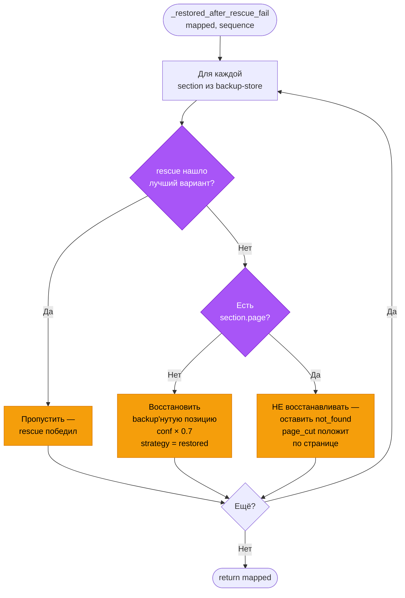

**Логика**: дальний page-distance match почти всегда ложен (нашёл в Index/Appendix). Если у секции **есть** страница — отдать page_cut, иначе восстановить (page_cut бессилен). До s4 всегда восстанавливали → возвращали ложные срабатывания (Do Good copyright, Главы 1/3/5/7).

### 5.3. Class-2 Fix B: `_revert_position_clusters`

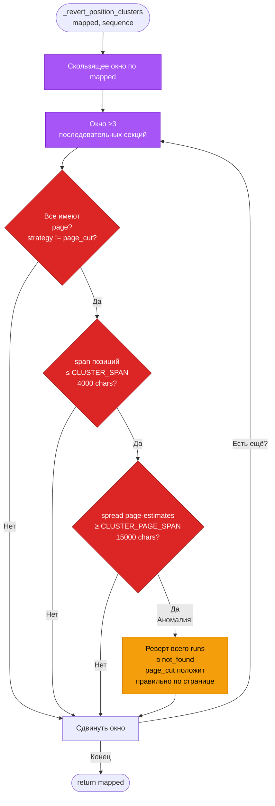

**Аномальный сигнал**: позиции crammed в маленьком окне (4K chars) при page-estimates spread на широком окне (15K chars) = back-matter список глав/индекс, не реальные body. Бесплатно фиксирует Do Good Главы 8–12 (3K span на 5 глав!) при page-estimates 180–230K. Не срабатывает на parallelnoe/Массель (позиции crammed без page spread — это норма для плотной книги).

### 5.4. Стратегии и confidence

| Strategy | Confidence | Очистка |
|---|---|---|
| `exact` | 1.00 | algo |
| `tokenized_regex` | 0.85 | algo |
| `exact_normalized` | 1.00 | algo |
| `page_hint_exact` | 0.90 | algo |
| `page_hint_tokenized` | 0.75 | LLM |
| `embedding_rescue` | 0.50–0.70 | LLM |
| `fuzzy_rescue` | ~0.70 | LLM |
| `llm_rescue` | 0.55 | LLM |
| `partial_words` | 0.60 | LLM |
| `num_prefix` | 0.40 | LLM |
| `page_cut` | 0.30 | algo (bypass `fix_chapter_boundary`) |
| `reverted_*` | 0.00 | не очищается (пустой content) |

---

## 6. List-context preference в `pdf_utils._search_with_confidence`

Это критический фикс маппинга, без которого книги с in-body bulleted summaries деградируют. Применяется к `exact` и `tokenized` стратегиям.

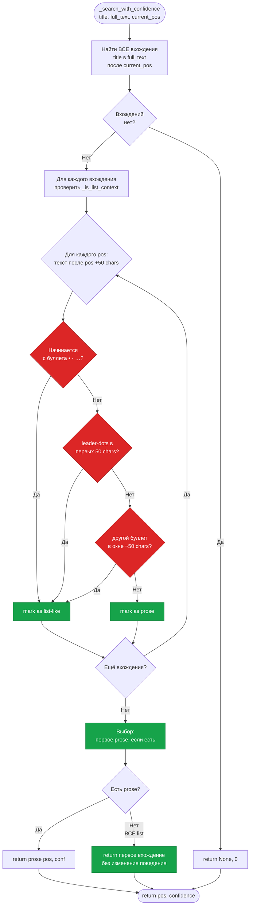

**Зачем**: в книгах с in-body bulleted summaries (Розенсон) или leader-dot mini-contents (Кениг) первое вхождение title — это в bullet-list. Без list-context preference content = «•» или dots. Хуже: неправильный ранний матч сдвигает `current_pos`, и следующие title не находятся → page_cut → garbled content (Клейнман cascade regression).

С фиксом: Розенсон/Кениг body recovered (ratio ~1.0), Клейнман 0 page_cut.

---

## 7. OCR Engine с recovery на 400

`ocr_engine.ocr_document()` — обработка всех страниц с защитой от частичных потерь.

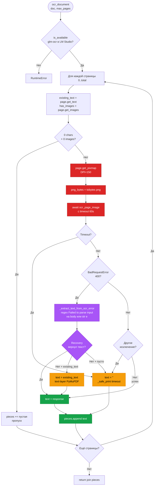

**Recovery**: glm-ocr возвращает HTTP 400 «Failed to parse input» с OCR-текстом ВНУТРИ тела ошибки. `_extract_text_from_ocr_error` достаёт это regex'ом, и страница не теряется. Fallback на text-layer PyMuPDF — если recovery вернуло пустоту, но текстовый слой PDF существует. Никогда не молча дропать страницы.

---

## 8. Content cleaning — два пути

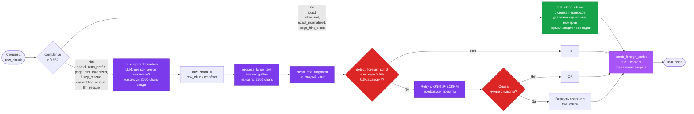

**Защита от CJK** — в три слоя:
1. Промпт `clean_text_fragment` фиксирует `target_lang` через сравнение долей кириллицы/латиницы на первых 300 chars входа.
2. После LLM-вывода `detect_foreign_script` считает долю CJK; если ≥5% — retry с «КРИТИЧЕСКАЯ ОШИБКА» префиксом.
3. Финальный `scrub_foreign_script` в `pdf_parser_neural.py` post-loop — удаляет любые остаточные CJK/арабские символы из title + content на ВСЕХ путях. Это бэкстоп.

### 8.1. Удаление постраничных водяных знаков (s013)

Отдельная очистка — постраничные водяные знаки («Библиотека БГУИР» 787×, «MIL-STD-1472G» 380×),
которые `clean_footer_header` пропускал (16 символов < `HEADER_JUNK_MIN_LEN=20`).

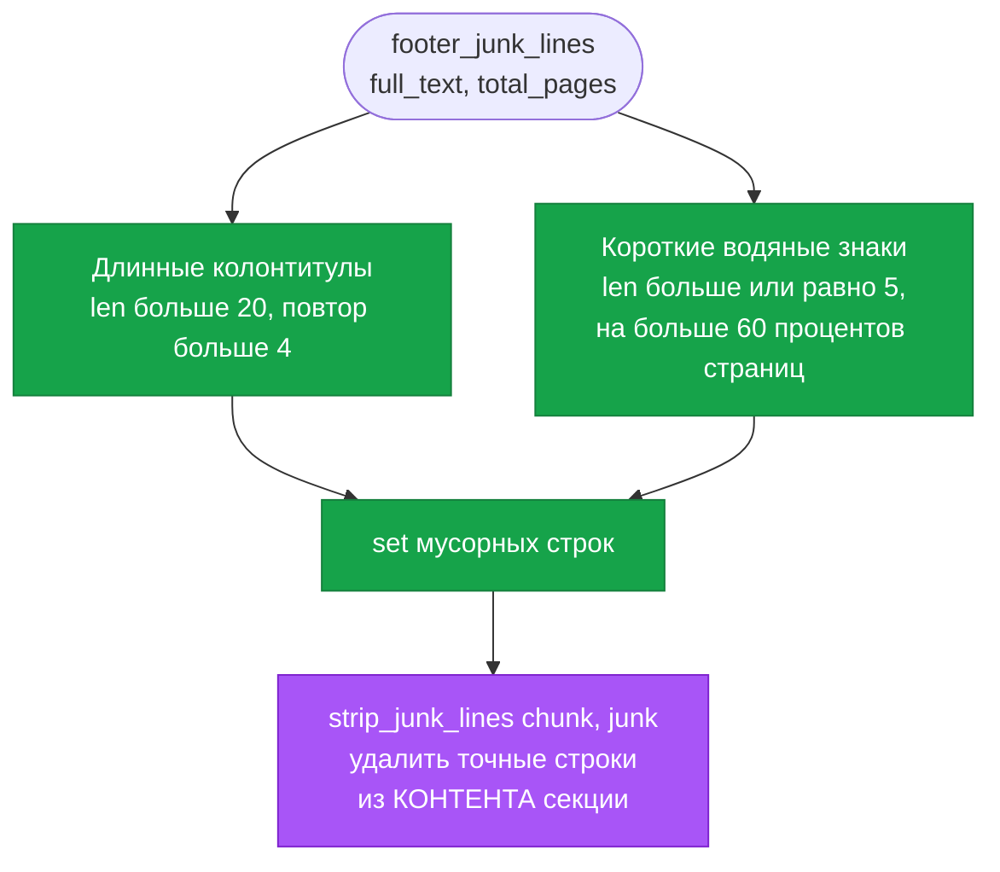

**Две ловушки, пойманные при реализации (обе до коммита)**:

1. **Сдвиг позиций.** Первая версия чистила водяной знак из `full_text` ДО маппинга → текст
   на 15k короче → линейные page_cut-позиции уехали → 136 секций потеряли контент, включая
   реальные. **Фикс — декаплинг**: `full_text` для маппинга нетронут, водяной знак удаляется
   только из УЖЕ нарезанного контента секции (`strip_junk_lines` на slice-шаге).
2. **Риск удалить контент.** Порог 0.30 ловил не только водяные знаки, но и повторяющийся
   КОНТЕНТ (parallelnoe «Объявление» 39%, ВКР названия федеральных округов 31%). **Порог поднят
   до `HEADER_WATERMARK_PAGE_FRACTION=0.60`**: настоящие водяные знаки на 82–100% страниц,
   контент ≤39% — зазор 39%↔82% чистый. Сопоставление по точным строкам, не подстрокам.

**Эффект**: 12_100229 «БГУИР» в превью 45→0; MIL-STD «MIL-STD-1472G» 22→0; остальные 17 книг
не затронуты. real −8/−1 — это ЧЕСТНО (секции, раздутые водяным знаком выше 100 символов,
оказались <100 реального контента).

---

## 9. Карта функций по модулям

Самая частая навигация — «где живёт эта функция / что от чего зависит». Полная карта:

```mermaid
graph LR
    subgraph pdf_parser_neural.py
        PPN_main["parse_pdf_neural"]
        PPN_main --> PPN_body["_pick_body_source s12"]
        PPN_main --> PPN_clean[scrub_foreign_script post-loop]
        PPN_main --> PPN_strip["strip_junk_lines per-section s13"]
    end

    subgraph toc_builder.py
        TB_build["build_toc"]
        TB_build --> TB_heur["_heuristic"]
        TB_build --> TB_llm["_llm_from_text_retry"]
        TB_build --> TB_ocrh["_ocr_then_heuristic"]
        TB_build --> TB_ocrl["_ocr_then_llm"]
        TB_build --> TB_deep["_deep_scan"]
        TB_build --> TB_expand["_llm_expand_parts"]
        TB_build --> TB_dedup["_dedup_and_order"]
        TB_build --> TB_split["_split_sticky_toc_lines"]
        TB_build --> TB_incomp["_looks_incomplete"]
        TB_build --> TB_select["_select_best"]
        TB_dedup --> TB_fuzzy["_drop_fuzzy_pageless_dupes"]
        TB_incomp --> TB_count["_count_toc_entry_lines"]
        TB_select --> TV_score
        TB_llm --> TB_norm["_normalize_llm_items"]
    end

    subgraph toc_validate.py
        TV_score["score_toc"]
        TV_score --> TV_formal["check_formal"]
        TV_score --> TV_cjk["check_cjk"]
        TV_score --> TV_ground["_ground_titles"]
        TV_valid["is_valid"]
    end

    subgraph toc_parser.py
        TP_parse["HeuristicParser.parse_toc"]
        TP_parse --> TP_split["_split_sticky"]
        TP_parse --> TP_garb["_is_garbage_toc_item"]
        TP_parse --> TP_guess["_guess_level"]
        TP_parse --> TP_trim["_trim_description_after_section_name"]
        TP_lin["toc_to_linear_sequence"]
    end

    subgraph mapping_pipeline.py
        MP_main["map_sequence"]
        MP_main --> MP_find["find_real_indices"]
        MP_main --> MP_verify["_verify_and_correct_order"]
        MP_main --> MP_ph["_page_hint_search"]
        MP_main --> MP_fuzz["_fuzzy_locate"]
        MP_main --> MP_emb["embedding_rescue"]
        MP_main --> MP_llm["llm_rescue"]
        MP_main --> MP_restA["_restored_after_rescue_fail"]
        MP_main --> MP_revB["_revert_position_clusters"]
        MP_main --> MP_pcut["page_cut"]
        MP_verify --> MP_toc["_looks_like_toc_content"]
    end

    subgraph pdf_utils.py
        PU_find["find_real_indices"]
        PU_find --> PU_search["_search_with_confidence"]
        PU_search --> PU_list["_is_list_context"]
        PU_search --> PU_first["_find_first_nonlist"]
        PU_search --> PU_first2["_first_nonlist_match"]
        PU_fast["fast_clean_chunk"]
        PU_clean["clean_footer_header"]
        PU_junk["footer_junk_lines / strip_junk_lines s13"]
        PU_read["check_document_readability"]
    end

    subgraph llm_engine.py
        LE_extract["extract_toc_json"]
        LE_extract --> LE_parse["_parse_toc_items"]
        LE_locate["locate_section_in_text"]
        LE_clean["clean_text_fragment"]
        LE_proc["process_large_text"]
        LE_boundary["fix_chapter_boundary"]
        LE_scrub["scrub_foreign_script"]
        LE_detect["detect_foreign_script"]
        LE_msg["_extract_message_content"]
    end

    subgraph ocr_engine.py
        OE_doc["ocr_document"]
        OE_doc --> OE_page["ocr_page_image"]
        OE_doc --> OE_safe["_safe_print"]
        OE_doc --> OE_extract["_extract_text_from_ocr_error"]
        OE_avail["is_available"]
    end

    subgraph embedding_engine.py
        EE_locate["locate_section"]
        EE_top["top_matches"]
        EE_embed["_embed_text"]
    end

    PPN_main --> TB_build
    PPN_main --> MP_main
    PPN_main --> PU_read
    PPN_main --> LE_scrub
    PPN_main --> PU_fast
    PPN_main --> LE_clean
    PPN_main --> LE_boundary
    PPN_main --> LE_proc
    PPN_main --> OE_doc

    TB_build --> TP_parse
    TB_build --> LE_extract
    TB_build --> OE_doc
    TB_build --> TV_score

    TV_ground --> EE_embed
    TV_cjk --> LE_detect

    MP_main --> PU_find
    MP_main --> EE_locate
    MP_main --> LE_locate

    LE_clean --> LE_detect
    LE_extract --> LE_parse
    LE_extract --> LE_msg

    classDef coord fill:#4a90e2,stroke:#2563eb,color:#fff
    classDef cascade fill:#7c3aed,stroke:#5b21b6,color:#fff
    classDef util fill:#16a34a,stroke:#15803d,color:#fff
    classDef adapter fill:#f59e0b,stroke:#d97706,color:#000
    classDef validator fill:#a855f7,stroke:#7e22ce,color:#fff

    class PPN_main coord
    class TB_build,MP_main cascade
    class TP_parse,PU_find,PU_fast,PU_clean util
    class LE_extract,LE_clean,OE_doc,EE_locate adapter
    class TV_score validator
```

---

## 10. Сценарии — кто и когда задействуется

| Сценарий | Что вызывается |
|---|---|
| **Простая ВКР** (bookфизика, Машинное обучение, Виды UI) | `parse_pdf_neural` → `build_toc` (early exit на heuristic) → `map_sequence` (только regex) → `fast_clean_chunk`. **Без LLM/OCR/embed.** |
| **Книга со сложной вёрсткой ToC** (Розенсон, Клейнман) | `parse_pdf_neural` → `build_toc` (heuristic неполна → `_llm_from_text_retry` → `_select_best` → выбран llm) → `map_sequence` (regex + list-context fix) → mix `fast_clean_chunk` и `clean_text_fragment` |
| **Книга с двумя ToC** (Release It!) | `parse_pdf_neural` → `build_toc` (heuristic 153 ловит оба ToC + dedup) → `map_sequence` (раннее verify ловит in-ToC + restore) → mostly `fast_clean_chunk` |
| **Стандарт с List of Figures** (MIL-STD-1472G) | `parse_pdf_neural` → `build_toc` (heuristic + TERMINAL_SECTION_MARKERS останавливает у Figures) → `map_sequence` (regex + Class-2 reverts) → `fast_clean_chunk` |
| **Книга с битой кодировкой** (0e6e53b) | `parse_pdf_neural` → `check_document_readability=False` → `ocr_client.ocr_document` (включая 400 recovery) → `build_toc` с ocr_text (level 3 OCR heuristic → level 4 OCR LLM → выбран ocr_llm) → `map_sequence` (embedding_rescue heavy) → mix `clean_text_fragment` |
| **Книга с крупно-типографскими заголовками** (Иглмен) | `parse_pdf_neural` → `build_toc` (LLM) → `map_sequence` (regex не находит → page_cut спасает) → mix |
| **Читаемая книга с OCR-ToC** (digital-design) | `parse_pdf_neural` → `build_toc` даёт короткий `ocr_text` → **`_pick_body_source` (s12) выбирает полный text-layer (1.586M), а не 25k ToC** → `map_sequence` находит тело → real 24→97. Остаток: 46 page_cut (OCR-титулы не string-match тела) |
| **Книга с водяным знаком** (12_100229, MIL-STD) | `parse_pdf_neural` → `footer_junk_lines` (s13) находит «Библиотека БГУИР» / «MIL-STD-1472G» на >60% страниц → `strip_junk_lines` вырезает их из контента секций (позиции маппинга стабильны) → превью БГУИР 45→0 |
| **Книга с multi-line ToC** (1332, 12_100229, **Дефект Б**) | `parse_pdf_neural` → `build_toc` (heuristic, title = «1.», «2.» с пустым описанием) → `map_sequence` (exact matches на «1.» в header) → 10+ пустых |

---

## 11. Точки расширения

Места, куда хорошо вписываются новые слои:

| Куда | Что добавить | Польза |
|---|---|---|
| `build_toc` после `_select_best` | Post-process re-attach numerical prefix из raw text (Дефект А) | digital-design, 978-5-7996 — content починится |
| `HeuristicParser.parse_toc` после commit numbers-only title | Multi-line lookahead — пик следующую строку, мерж если non-page-bearing alphabetic (Дефект Б) | 1332, 12_100229 |
| `_looks_incomplete` | Окно вокруг СОДЕРЖАНИЕ-маркера или soft-cap ±10 страниц | ВКР — экономия 170с фейлящего fallback |
| Между fuzzy_rescue и embedding_rescue | OCR-aware edit-distance (распространённые замены и↔ы, ц↔щ, н↔п) | digital-design OCR drift |
| После всех rescue | Content-quality check: «body = leader-dots / bullet / ToC fragment?» → flag misplacement | Замена обманывающих coverage/length метрик |
| Новый этап перед page_cut | LLM `locate_chapter_by_summary` — отдать LLM модельный обзор контента + список глав, получить локации | Книги с крупно-типографскими headers где title не извлекается |

Каждое — известный класс дефектов с одним из 19+ книг как regression test.

---

## 12. Эволюция архитектуры по сессиям (когда что реализовано)

Хронология ключевых изменений в коде. Источник — `.project-brain/sessions/`. Ветка `llm-toc-fallback`.

| Сессия | Дата | Ключевые изменения в архитектуре |
|---|---|---|
| **001** | 2026-05-28 | `_safe_print` (фикс cp1251/U+FFFD краша OCR); `scrub_foreign_script` на ВСЕХ путях; dedup по title-only; `exact_normalized`=1.0; `_split_sticky_toc_lines`; **новый `toc_validator.py`** (OCR-валидация); safety-net пустого XML; WebSocket double-close; все флаги ON; OCR timeout/skip пустых страниц |
| **002** | 2026-05-28 | **page_cut перенесён ПОСЛЕ финального verify** (Иглмен 22/22); page_cut исключён из `running_max` |
| **003** | 2026-05-28 | Инструменты прогона: `run_pipeline.py` (OUT_DIR), `_report.json`, `analyze_xml.py`; baseline test_v2 |
| **004** | 2026-05-29 | Mechanism A (не ломать парсинг на разделителе двойного ToC); length-guard 250 (фикс backtracking); **новый `toc_validate.py`** (score/is_valid/CJK/formal/grounding); **smart ToC fallback + `_select_best` + `_looks_incomplete`**; JSON salvage `_parse_toc_items`; clamp level 1..3; **Class-2 Fix A `_restored_after_rescue_fail`** + **Fix B `_revert_position_clusters`**; **list-context preference** (`_is_list_context`/`_find_first_nonlist`); скрипты аудита (`audit_content`, `fitz_blindness`, `render_pages`, `mapping_audit`, `run_corpus`) |
| **005** | 2026-05-30 | `_drop_fuzzy_pageless_dupes` (dedup OCR-дрейфа, ВКР); **OCR 400 recovery** `_extract_text_from_ocr_error`; baseline tests_v4 (19 книг); открыты Дефекты А/Б |
| **006** | 2026-05-30 | **Дефект А fix** (prompt + `_reattach_numerical_prefixes`); `merge_wrap_continuations` + own-prefix guard (multi-line ToC, 12_100229); метрика `effective_real_sections`; prompt tighten |
| **007** | 2026-06-09/10 | retry 3→5; **anchor-interpolation page_cut** _(позже реверчено)_; **новый `content_quality.py`** (junk-детектор); **OCR-aware fuzzy** `_ocr_aware_fuzzy_locate`/`_ocr_fold` (порог 0.72) |
| **008** | 2026-06-10 | Честная верификация: anchor-interpolation ЛОМАЕТ AI/12_100229 (реальная потеря контента); bracketing-only + ordering-guard (в working tree) |
| **009** | 2026-06-27 | **`chars` XML-атрибут** (own-content length); доказан metric-trap (дублированные index-блобы); ordering-guard floor-cap; **решение: revert anchor-interpolation → чистый v6 linear** |
| **010** | 2026-06-27 | Локальный backward-anchor (точечно для MIL-STD 5.1.2.5) — безопасно, но не чинит (5.1.3 order-inversion) → реверт; bloat 5.1.2.5 принят |
| **011** | 2026-06-27 | **page_cut same-page staggering** (Fix B): дубли контента 50→4 |
| **012** | 2026-06-27/28 | **`_pick_body_source`** — выбор тела сравнением кандидатов (раздел 3.1); системный фикс: digital-design 24→97, корпус +78 real |
| **013** | 2026-06-28 | **Постраничные водяные знаки** `footer_junk_lines`/`strip_junk_lines` (порог 0.60), очистка из контента секций с декаплингом от позиций маппинга (раздел 8.1) |

**Дважды реверченный механизм** ⚠️: глобальная anchor-interpolation page_cut (введена s007 → реверчена s009/010). Текущий page_cut = **чистая линейная оценка + same-page staggering**. НЕ возвращать anchor-interpolation: она поломала AI (184→167/169, дублированные index-блобы) ради одного MIL-STD 5.1.2.5.

**Два механизма «сравнения», часто путаемые**:
- `_select_best` (s004) — сравнивает КАНДИДАТОВ ОГЛАВЛЕНИЯ из разных источников (heuristic/LLM/OCR) по grounding (раздел 4.1).
- `_pick_body_source` (s012) — сравнивает ИСТОЧНИКИ ТЕЛА (text-layer ↔ OCR) по качеству и охвату (раздел 3.1).

### Метрика-ловушка (сквозной урок)

`real_content_sections` (секций с >100 символов) **обманывает**: page_cut во front-matter, padding водяным знаком и дублированные блобы — всё считается «real». Судить по `match_strategy`-миксу + содержимому, а НЕ по счётчику. Честные сигналы: атрибут `chars` (s9) и инспекция контента глазами.

