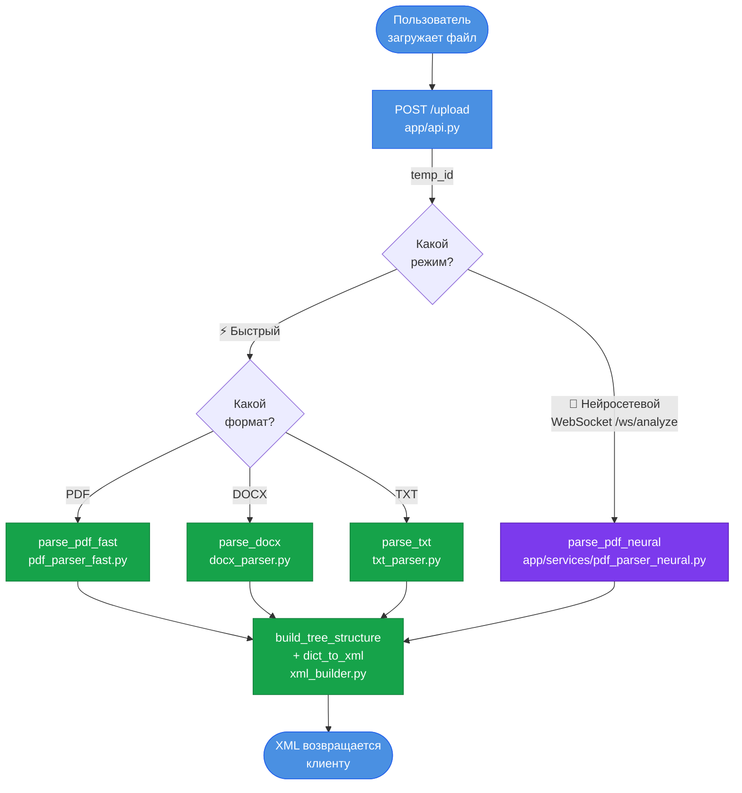
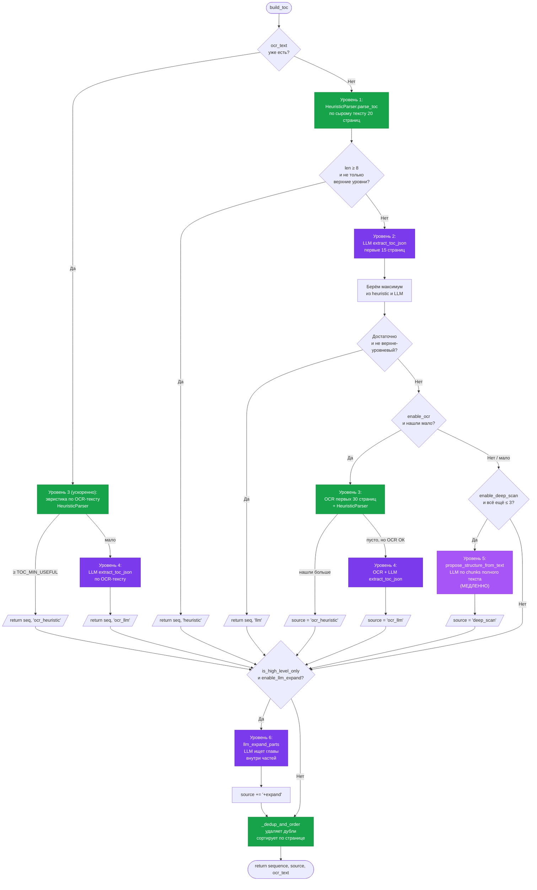
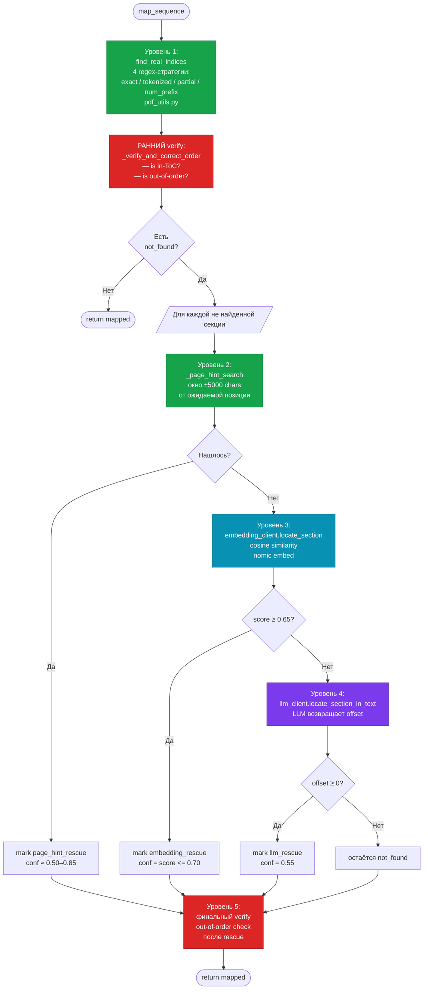
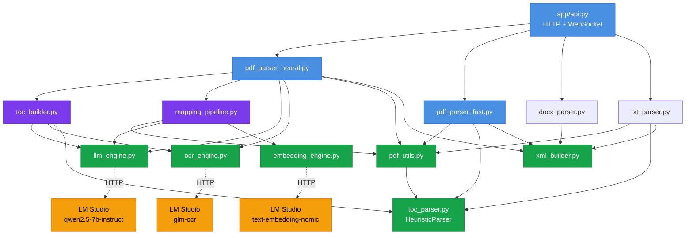

# Полный pipeline парсинга

Диаграммы рендерятся автоматически в GitHub, VSCode (с расширением Mermaid Preview), на [mermaid.live](https://mermaid.live).

---

## 1. Высокоуровневый flow

От загрузки файла до возврата XML клиенту.



**Точки выбора:**
- Клиент выбирает режим: `fast` (HTTP) или `neural` (WebSocket).
- Fast-режим — детерминированный, без LLM, секунды на любую книгу.
- Neural-режим — каскад с возможным OCR и LLM, минуты на сложные книги.

---

## 2. Neural pipeline целиком

Это основная отказоустойчивая система. Каждый блок — отдельный fallback уровень.

```mermaid
flowchart TD
    NIN([parse_pdf_neural]) --> READ["check_document_readability<br/>pdf_utils.py"]

    READ -->|is_readable=True| TOC_BUILDER
    READ -->|is_readable=False| OCR_CHECK{OCR<br/>доступен?<br/>use_ocr=True?}

    OCR_CHECK -->|Да| OCR_DOC["ocr_client.ocr_document<br/>glm-ocr через LM Studio<br/>ocr_engine.py"]
    OCR_CHECK -->|Нет| ERR_NODE[Возврат узла<br/>«Документ нечитаем»]

    OCR_DOC -->|ocr_text есть| TOC_BUILDER[/"Этап 1:<br/>построение оглавления<br/>(см. диаграмму ToC Builder)"/]
    OCR_DOC -->|пусто| ERR_NODE

    TOC_BUILDER -->|sequence, toc_source| FULL_TEXT["clean_footer_header<br/>от колонтитулов<br/>pdf_utils.py"]
    FULL_TEXT --> MAPPING[/"Этап 2:<br/>маппинг секций<br/>(см. диаграмму Mapping)"/]

    MAPPING -->|mapped| SLICE[Нарезка контента<br/>full_text&#91;end_idx : next_start&#93;]
    SLICE --> CLEAN_LOOP{Для каждой секции:<br/>confidence ≥ 0.80?}

    CLEAN_LOOP -->|Да| FAST_CLEAN["fast_clean_chunk<br/>алгоритм<br/>pdf_utils.py"]
    CLEAN_LOOP -->|Нет| LLM_BOUNDARY["fix_chapter_boundary<br/>llm_engine.py"]

    LLM_BOUNDARY --> LLM_CLEAN["process_large_text<br/>+ clean_text_fragment<br/>(с защитой от CJK)<br/>llm_engine.py"]

    FAST_CLEAN --> XML_BUILD
    LLM_CLEAN --> XML_BUILD["build_tree_structure<br/>dict_to_xml<br/>xml_builder.py"]
    ERR_NODE --> XML_BUILD

    XML_BUILD --> RETURN([XML + stats])

    classDef stage fill:#4a90e2,stroke:#2563eb,color:#fff
    classDef llm fill:#7c3aed,stroke:#5b21b6,color:#fff
    classDef ocr fill:#dc2626,stroke:#991b1b,color:#fff
    classDef algo fill:#16a34a,stroke:#15803d,color:#fff
    classDef err fill:#f59e0b,stroke:#d97706,color:#fff

    class READ,FULL_TEXT,SLICE,FAST_CLEAN algo
    class OCR_DOC ocr
    class LLM_BOUNDARY,LLM_CLEAN llm
    class TOC_BUILDER,MAPPING stage
    class ERR_NODE err
```



**Где какие модели вызываются:**

| Модель | Через что | Когда |
|---|---|---|
| `qwen2.5-7b-instruct` (LLM) | `llm_engine.py` | ToC fallback, locate_section, fix_chapter_boundary, clean_text_fragment |
| `text-embedding-nomic-embed-text-v1.5` | `embedding_engine.py` | Семантический поиск секций (rescue) |
| `glm-ocr` (Vision LLM) | `ocr_engine.py` | OCR нечитаемых PDF |

---

## 3. ToC Builder — каскад из 6 уровней

`toc_builder.py · build_toc()`



**Логика каскада:**

| Уровень | Метод | Стоимость | Когда срабатывает |
|---|---|---|---|
| **1** | Эвристика (HeuristicParser) | Мгновенно | Всегда, первый шаг |
| **2** | LLM extract_toc_json по первым 15 стр. | Секунды | Если уровень 1 нашёл < 8 секций или только level 1 |
| **3** | OCR первых 30 стр. + HeuristicParser | 1–2 минуты | Если уровни 1+2 дали < 8 секций и `enable_ocr=True` |
| **4** | OCR + LLM | Минуты | Если OCR-эвристика не сработала |
| **5** | Deep-scan: LLM по всему тексту chunks | 10+ минут | Только при явном `enable_deep_scan=True` и всё ещё мало |
| **6** | LLM-expand: ищет главы внутри ЧАСТЕЙ | Секунды–минуты | Если ToC только верхнеуровневый (как Иглмен) |
| **Финал** | `_dedup_and_order` | Мгновенно | Всегда: убирает дубли при двух ToC, сортирует по странице |

---

## 4. Mapping Pipeline — каскад из 5 уровней

`mapping_pipeline.py · map_sequence()`



**Особенности:**

- **Раннее `verify`** — это была важная архитектурная правка. Если find_real_indices «нашла» все 36 секций ВНУТРИ страниц ToC (sequential lock завёл в зону содержания), без раннего verify все они шли в XML с confidence=1.0. Теперь verify сначала помечает ложные находки как not_found, и они проходят rescue, который размещает их по правильным местам.

- **Page-hint** работает только если у секции есть `page` из ToC. Это решает проблему «секция найдена в Примечаниях» — Примечания обычно в конце книги, далеко от ожидаемой позиции главы.

- **Embeddings ставятся ДО LLM**, потому что они быстрее. LLM-rescue вызывается только если embeddings вернули score < 0.65.

---

## 5. Verification layer — что именно проверяется

`mapping_pipeline.py · _verify_and_correct_order()`

```mermaid
flowchart TD
    V_IN([_verify_and_correct_order]) --> CHK1[Проверка 1:<br/>«контент это сам ToC»]

    CHK1 --> LOOP1{Для каждой<br/>найденной секции}
    LOOP1 --> PREVIEW["full_text&#91;end_idx : end_idx + 800&#93;<br/>(фиксированное окно,<br/>НЕ ограничивая next_start)"]
    PREVIEW --> TOC_LIKE{"_looks_like_toc_content<br/>&gt; 50% строк выглядят как<br/>'текст ....... номер'?"}

    TOC_LIKE -->|Да| MARK1[mark<br/>reverted_in_toc<br/>start_idx = -1]
    TOC_LIKE -->|Нет| KEEP1[оставить]

    MARK1 --> CHK2
    KEEP1 --> CHK2

    CHK2[Проверка 2:<br/>порядок секций] --> LOOP2{Для каждой<br/>оставшейся}
    LOOP2 --> RUN_MAX{start_idx меньше<br/>running_max - 1000?<br/>+ strategy = rescue?}

    RUN_MAX -->|Да| MARK2[mark<br/>reverted_out_of_order<br/>start_idx = -1]
    RUN_MAX -->|Нет| UPDATE[running_max = max]

    MARK2 --> V_OUT
    UPDATE --> V_OUT([return mapped])

    classDef verify fill:#dc2626,stroke:#991b1b,color:#fff
    classDef action fill:#f59e0b,stroke:#d97706,color:#fff

    class CHK1,CHK2,TOC_LIKE,RUN_MAX verify
    class MARK1,MARK2 action
```



**Что отлавливают эти две проверки:**

| Проверка | Какая ошибка ловится | Пример |
|---|---|---|
| **In-ToC** | Секция «найдена» прямо в страницах оглавления | Release It!: 21 главы из 36 |
| **Out-of-order** | Rescue нашёл совпадение в Глоссарии / Примечаниях | Do Good Design: 3 ложных rescue |

После verify такие секции возвращаются на rescue pipeline и часто находят правильное место через page-hint.

---

## 6. Очистка контента — два уровня

Для каждой найденной секции выбирается стратегия очистки:

```mermaid
flowchart LR
    SEC([Секция с<br/>raw_chunk]) --> CONF{confidence<br/>≥ 0.80?}

    CONF -->|Да<br/>exact, tokenized_regex| ALGO["fast_clean_chunk<br/>• склейка переносов<br/>• удаление одиночных номеров<br/>• нормализация переводов строк<br/>pdf_utils.py"]

    CONF -->|Нет<br/>partial, num_prefix,<br/>rescue| LLM_BOUND["fix_chapter_boundary<br/>LLM: где кончается заголовок?<br/>llm_engine.py"]

    LLM_BOUND -->|offset| TRIM[Обрезать заголовок<br/>raw_chunk = raw_chunk&#91;offset:&#93;]
    TRIM --> LLM_PROCESS["process_large_text<br/>чанки по 2500 chars<br/>↓<br/>clean_text_fragment"]

    LLM_PROCESS --> LANG_CHECK{detect_foreign_script<br/>&gt; 5% CJK / арабский?}
    LANG_CHECK -->|Нет| OK1[OK]
    LANG_CHECK -->|Да| RETRY["Retry с КРИТИЧЕСКИМ<br/>префиксом промпта"]
    RETRY --> LANG_CHECK2{Снова<br/>чужие символы?}
    LANG_CHECK2 -->|Да| FALLBACK[Вернуть<br/>оригинальный текст]
    LANG_CHECK2 -->|Нет| OK2[OK]

    ALGO --> NODE
    OK1 --> NODE
    OK2 --> NODE
    FALLBACK --> NODE([final_node<br/>добавлен в результат])

    classDef algo fill:#16a34a,stroke:#15803d,color:#fff
    classDef llm fill:#7c3aed,stroke:#5b21b6,color:#fff
    classDef guard fill:#dc2626,stroke:#991b1b,color:#fff

    class ALGO algo
    class LLM_BOUND,LLM_PROCESS llm
    class LANG_CHECK,LANG_CHECK2,RETRY guard
```



**Confidence-tiers (определяются в `mapping_pipeline.py`):**

| Strategy | Confidence | Очистка |
|---|---|---|
| `exact` | 1.00 | Алгоритм |
| `tokenized_regex` | 0.85 | Алгоритм |
| `page_hint_exact` | 0.90 | Алгоритм |
| `page_hint_tokenized` | 0.75 | LLM |
| `embedding_rescue` | 0.50–0.70 | LLM |
| `llm_rescue` | 0.55 | LLM |
| `partial_words` | 0.60 | LLM |
| `num_prefix` | 0.40 | LLM |
| `reverted_*` | 0.00 | Не очищается (пустой content) |

---

## 7. Где какие точки fallback'a

Слой за слоем — что происходит, если один метод не справляется.

```mermaid
flowchart LR
    subgraph Текст["Извлечение текста"]
        T1["PyMuPDF get_text"] -.не помог.-> T2["Garbage check ловит"] -.if garbage.-> T3["glm-ocr OCR"]
    end

    subgraph ToC["Извлечение оглавления"]
        TC1["Эвристика"] -.мало.-> TC2["LLM extract_toc"] -.мало+OCR доступен.-> TC3["OCR + эвристика"]
        TC3 -.мало.-> TC4["OCR + LLM"] -.deep_scan.-> TC5["Deep-scan по chunks"]
        TC5 -.верх. уровни.-> TC6["LLM-expand parts"]
    end

    subgraph Маппинг["Маппинг секций"]
        M1["regex 4 стратегии"] -.не нашло.-> M2["page-hint window"]
        M2 -.не нашло.-> M3["embeddings cosine"]
        M3 -.низкий score.-> M4["LLM locate"]
        M4 -.-> M5["verify в случае ошибки"]
    end

    subgraph Очистка["Очистка контента"]
        C1["fast_clean_chunk алгоритм"] -.low conf.-> C2["LLM clean"]
        C2 -.CJK обнаружен.-> C3["retry со строгим промптом"]
        C3 -.снова CJK.-> C4["вернуть оригинал"]
    end

    Текст --> ToC --> Маппинг --> Очистка
```

---

## 8. Карта модулей и зависимостей



**Логическое разделение:**
- **HTTP layer** (`api.py`) — приём файлов, WebSocket прогресс, отдача XML
- **Парсеры по форматам** (`pdf_parser_*`, `docx_parser`, `txt_parser`) — entry point для каждого формата
- **Каскады** (`toc_builder`, `mapping_pipeline`) — отказоустойчивая логика
- **Адаптеры к моделям** (`llm_engine`, `embedding_engine`, `ocr_engine`) — изолируют код от деталей API LM Studio
- **Утилиты** (`pdf_utils`, `toc_parser`, `xml_builder`) — переиспользуемые блоки

---

## 9. Когда какой режим запускается

Сценарии и какие компоненты задействованы:

| Сценарий | Что задействуется |
|---|---|
| **Простая ВКР** (Массель, Виды интерфейсов) | эвристика ToC → regex mapping → fast_clean. **LLM/OCR не вызываются вообще.** |
| **Книга со сложным ToC** (Кениг) | эвристика 0–2 → **LLM extract_toc_json** → regex mapping + page-hint rescue → fast_clean |
| **Книга с двумя ToC** (Release It!) | эвристика 36 → dedup → regex mapping → **раннее verify** ловит 21 in-ToC → **page-hint rescue** → fast/LLM clean |
| **Военный стандарт с List of Figures** (MIL-STD) | эвристика + terminator → 750 → regex mapping → 0 miss |
| **Книга с битой кодировкой** (0e6e53b) | garbage detection → **glm-ocr** распознаёт все страницы → эвристика по OCR-тексту → regex mapping → fast_clean |
| **Книга с верхнеуровневым ToC** (Иглмен) | эвристика 6 → **LLM-expand parts** → regex mapping + embedding rescue → LLM clean **с защитой от CJK** |
| **Книга без ToC** (гипотетическая) | эвристика 0 → LLM extract_toc_json 0 → (OCR при unreadable) → **deep_scan** (если включён флагом) |
